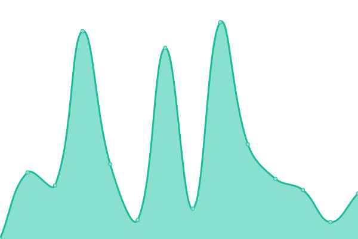

# [📈 Live Status](https://jpleasants.github.io/plesk9): <!--live status--> **🟧 Partial outage**

This repository contains the open-source uptime monitor and status page for [jpleasants](https://jpleasants.github.io/plesk9), powered by [Upptime](https://github.com/upptime/upptime).

With [Upptime](https://upptime.js.org), you can get your own unlimited and free uptime monitor and status page, powered entirely by a GitHub repository. We use [Issues](https://github.com/jpleasants/plesk9/issues) as incident reports, [Actions](https://github.com/jpleasants/plesk9/actions) as uptime monitors, and [Pages](https://jpleasants.github.io/plesk9) for the status page.

<!--start: status pages-->
<!-- This summary is generated by Upptime (https://github.com/upptime/upptime) -->
<!-- Do not edit this manually, your changes will be overwritten -->
<!-- prettier-ignore -->
| URL | Status | History | Response Time | Uptime |
| --- | ------ | ------- | ------------- | ------ |
|  [plesk 11](https://plesk11.samitsolutions.com) | 🟥 Down | [plesk-11.yml](https://github.com/jpleasants/plesk9/commits/HEAD/history/plesk-11.yml) | 

 4169ms
     
 | 

<a href="https://jpleasants.github.io/plesk11/history/plesk-11">75.74%</a>
    

|  [marchtothepolls](https://marchtothepolls.org) | 🟩 Up | [marchtothepolls.yml](https://github.com/jpleasants/plesk9/commits/HEAD/history/marchtothepolls.yml) | 

 100ms
     
 | 

<a href="https://jpleasants.github.io/plesk11/history/marchtothepolls">100.00%</a>
    

|  [picklesandplay](https://picklesandplay.com) | 🟩 Up | [picklesandplay.yml](https://github.com/jpleasants/plesk9/commits/HEAD/history/picklesandplay.yml) | 

 97ms
     
 | 

<a href="https://jpleasants.github.io/plesk11/history/picklesandplay">100.00%</a>
    

|  [tandooribitesdurham](https://tandooribitesdurham.com) | 🟩 Up | [tandooribitesdurham.yml](https://github.com/jpleasants/plesk9/commits/HEAD/history/tandooribitesdurham.yml) | 

 110ms
     
 | 

<a href="https://jpleasants.github.io/plesk11/history/tandooribitesdurham">100.00%</a>
    

|  [clintrialresearch](https://clintrialresearch.com/) | 🟥 Down | [clintrialresearch.yml](https://github.com/jpleasants/plesk9/commits/HEAD/history/clintrialresearch.yml) | 

 3616ms
     
 | 

<a href="https://jpleasants.github.io/plesk11/history/clintrialresearch">76.22%</a>
    

|  [OBSN](https://obsn.org) | 🟩 Up | [obsn.yml](https://github.com/jpleasants/plesk9/commits/HEAD/history/obsn.yml) | 

 206ms
     
 | 

<a href="https://jpleasants.github.io/plesk11/history/obsn">100.00%</a>
    

|  [cholanad](https://cholanad.com) | 🟥 Down | [cholanad.yml](https://github.com/jpleasants/plesk9/commits/HEAD/history/cholanad.yml) | 

 3371ms
     
 | 

<a href="https://jpleasants.github.io/plesk11/history/cholanad">76.66%</a>
    

|  [cmcbuildinginc](https://cmcbuildinginc.com) | 🟥 Down | [cmcbuildinginc.yml](https://github.com/jpleasants/plesk9/commits/HEAD/history/cmcbuildinginc.yml) | 

 3002ms
     
 | 

<a href="https://jpleasants.github.io/plesk11/history/cmcbuildinginc">77.10%</a>
    

|  [carolinaretinaeyecare](https://carolinaretinaeyecare.com) | 🟩 Up | [carolinaretinaeyecare.yml](https://github.com/jpleasants/plesk9/commits/HEAD/history/carolinaretinaeyecare.yml) | 

 121ms
     
 | 

<a href="https://jpleasants.github.io/plesk11/history/carolinaretinaeyecare">100.00%</a>
    

|  [samitsolutions](https://samitsolutions.com) | 🟩 Up | [samitsolutions.yml](https://github.com/jpleasants/plesk9/commits/HEAD/history/samitsolutions.yml) | 

 109ms
     
 | 

<a href="https://jpleasants.github.io/plesk11/history/samitsolutions">100.00%</a>
    

|  [chaskaindiancuisine](https://chaskaindiancuisine.com) | 🟥 Down | [chaskaindiancuisine.yml](https://github.com/jpleasants/plesk9/commits/HEAD/history/chaskaindiancuisine.yml) | 

 2318ms
     
 | 

<a href="https://jpleasants.github.io/plesk11/history/chaskaindiancuisine">77.55%</a>
    

|  [clovencardamom](https://clovencardamom.com) | 🟥 Down | [clovencardamom.yml](https://github.com/jpleasants/plesk9/commits/HEAD/history/clovencardamom.yml) | 

 3460ms
     
 | 

<a href="https://jpleasants.github.io/plesk11/history/clovencardamom">77.99%</a>
    

|  [vascularwellness](https://vascularwellness.com) | 🟩 Up | [vascularwellness.yml](https://github.com/jpleasants/plesk9/commits/HEAD/history/vascularwellness.yml) | 

 121ms
     
 | 

<a href="https://jpleasants.github.io/plesk11/history/vascularwellness">100.00%</a>
    

|  [tandooribites](https://tandooribites.net) | 🟩 Up | [tandooribites.yml](https://github.com/jpleasants/plesk9/commits/HEAD/history/tandooribites.yml) | 

 123ms
     
 | 

<a href="https://jpleasants.github.io/plesk11/history/tandooribites">100.00%</a>
    

|  [tandoorchapelhill](https://tandoorchapelhill.com) | 🟩 Up | [tandoorchapelhill.yml](https://github.com/jpleasants/plesk9/commits/HEAD/history/tandoorchapelhill.yml) | 

 80ms
     
 | 

<a href="https://jpleasants.github.io/plesk11/history/tandoorchapelhill">100.00%</a>
    

|  [africancaribbeanmarket](https://africancaribbeanmarket.com/) | 🟩 Up | [africancaribbeanmarket.yml](https://github.com/jpleasants/plesk9/commits/HEAD/history/africancaribbeanmarket.yml) | 

 169ms
     
 | 

<a href="https://jpleasants.github.io/plesk11/history/africancaribbeanmarket">100.00%</a>
    

|  [chaatmandinc](https://chaatmandinc.com) | 🟩 Up | [chaatmandinc.yml](https://github.com/jpleasants/plesk9/commits/HEAD/history/chaatmandinc.yml) | 

 62ms
     
 | 

<a href="https://jpleasants.github.io/plesk11/history/chaatmandinc">100.00%</a>
    

|  [freshindianmarket](https://freshindianmarket.com/) | 🟩 Up | [freshindianmarket.yml](https://github.com/jpleasants/plesk9/commits/HEAD/history/freshindianmarket.yml) | 

 107ms
     
 | 

<a href="https://jpleasants.github.io/plesk11/history/freshindianmarket">100.00%</a>
    

|  [epecsolutionsinc](https://epecsolutionsinc.com) | 🟥 Down | [epecsolutionsinc.yml](https://github.com/jpleasants/plesk9/commits/HEAD/history/epecsolutionsinc.yml) | 

 7102ms
     
 | 

<a href="https://jpleasants.github.io/plesk11/history/epecsolutionsinc">78.45%</a>
    

|  [carolinas](https://carolinas.tie.org) | 🟥 Down | [carolinas.yml](https://github.com/jpleasants/plesk9/commits/HEAD/history/carolinas.yml) | 

 2431ms
     
 | 

<a href="https://jpleasants.github.io/plesk11/history/carolinas">78.90%</a>
    

<!--end: status pages-->

[**Visit our status website →**](https://jpleasants.github.io/plesk9)

## 📄 License

- Powered by: [Upptime](https://github.com/upptime/upptime)
- Code: [MIT](./LICENSE) © [jpleasants](https://jpleasants.github.io/plesk9)
- Data in the `./history` directory: [Open Database License](https://opendatacommons.org/licenses/odbl/1-0/)
