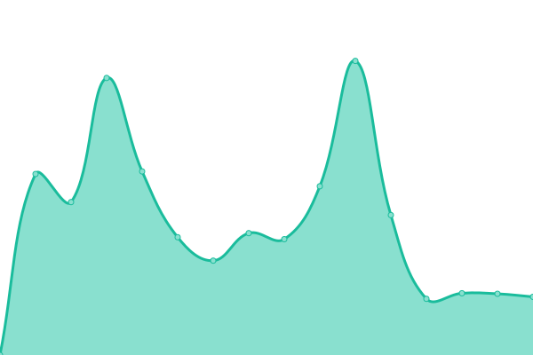

# [📈 Live Status](https://jpleasants.github.io/plesk9): <!--live status--> **🟩 All systems operational**

This repository contains the open-source uptime monitor and status page for [jpleasants](https://jpleasants.github.io/plesk9), powered by [Upptime](https://github.com/upptime/upptime).

With [Upptime](https://upptime.js.org), you can get your own unlimited and free uptime monitor and status page, powered entirely by a GitHub repository. We use [Issues](https://github.com/jpleasants/plesk9/issues) as incident reports, [Actions](https://github.com/jpleasants/plesk9/actions) as uptime monitors, and [Pages](https://jpleasants.github.io/plesk9) for the status page.

<!--start: status pages-->
<!-- This summary is generated by Upptime (https://github.com/upptime/upptime) -->
<!-- Do not edit this manually, your changes will be overwritten -->
<!-- prettier-ignore -->
| URL | Status | History | Response Time | Uptime |
| --- | ------ | ------- | ------------- | ------ |
|  [Plesk 9](https://plesk9.samitsolutions.com) | 🟩 Up | [plesk-9.yml](https://github.com/jpleasants/plesk9/commits/HEAD/history/plesk-9.yml) | 

 734ms
     
 | 

<a href="https://jpleasants.github.io/plesk9/history/plesk-9">97.00%</a>
    

|  [OBSN](https://obsn.org) | 🟩 Up | [obsn.yml](https://github.com/jpleasants/plesk9/commits/HEAD/history/obsn.yml) | 

 416ms
     
 | 

<a href="https://jpleasants.github.io/plesk9/history/obsn">96.31%</a>
    

|  [Saffron Cary](https://saffroncary.com) | 🟩 Up | [saffron-cary.yml](https://github.com/jpleasants/plesk9/commits/HEAD/history/saffron-cary.yml) | 

 135ms
     
 | 

<a href="https://jpleasants.github.io/plesk9/history/saffron-cary">100.00%</a>
    

|  [Chaat Mandi NC](https://chaatmandinc.com) | 🟩 Up | [chaat-mandi-nc.yml](https://github.com/jpleasants/plesk9/commits/HEAD/history/chaat-mandi-nc.yml) | 

 2247ms
     
 | 

<a href="https://jpleasants.github.io/plesk9/history/chaat-mandi-nc">96.35%</a>
    

|  [Maharaja NC](https://maharajanc.com) | 🟩 Up | [maharaja-nc.yml](https://github.com/jpleasants/plesk9/commits/HEAD/history/maharaja-nc.yml) | 

 8685ms
     
 | 

<a href="https://jpleasants.github.io/plesk9/history/maharaja-nc">93.52%</a>
    

|  [Thali RTP](https://thalirtp.com) | 🟩 Up | [thali-rtp.yml](https://github.com/jpleasants/plesk9/commits/HEAD/history/thali-rtp.yml) | 

 7045ms
     
 | 

<a href="https://jpleasants.github.io/plesk9/history/thali-rtp">95.10%</a>
    

|  [NC Spices](https://ncspices.com) | 🟩 Up | [nc-spices.yml](https://github.com/jpleasants/plesk9/commits/HEAD/history/nc-spices.yml) | 

 5524ms
     
 | 

<a href="https://jpleasants.github.io/plesk9/history/nc-spices">95.07%</a>
    

|  [Directed Facility Solutions](https://directedfacilitysolutions.com) | 🟩 Up | [directed-facility-solutions.yml](https://github.com/jpleasants/plesk9/commits/HEAD/history/directed-facility-solutions.yml) | 

 578ms
     
 | 

<a href="https://jpleasants.github.io/plesk9/history/directed-facility-solutions">95.51%</a>
    

|  [NCS Global Inc](https://ncsglobalinc.com) | 🟩 Up | [ncs-global-inc.yml](https://github.com/jpleasants/plesk9/commits/HEAD/history/ncs-global-inc.yml) | 

 2194ms
     
 | 

<a href="https://jpleasants.github.io/plesk9/history/ncs-global-inc">95.40%</a>
    

|  [Park Life](https://parklifecomm.com) | 🟩 Up | [park-life.yml](https://github.com/jpleasants/plesk9/commits/HEAD/history/park-life.yml) | 

 370ms
     
 | 

<a href="https://jpleasants.github.io/plesk9/history/park-life">100.00%</a>
    

|  [March to The Polls](https://marchtothepolls.org) | 🟩 Up | [march-to-the-polls.yml](https://github.com/jpleasants/plesk9/commits/HEAD/history/march-to-the-polls.yml) | 

 5861ms
     
 | 

<a href="https://jpleasants.github.io/plesk9/history/march-to-the-polls">95.74%</a>
    

|  [MS Hubs](https://mshubs.com) | 🟩 Up | [ms-hubs.yml](https://github.com/jpleasants/plesk9/commits/HEAD/history/ms-hubs.yml) | 

 308ms
     
 | 

<a href="https://jpleasants.github.io/plesk9/history/ms-hubs">100.00%</a>
    

|  [Epec Solutions Inc](https://epecsolutionsinc.com) | 🟩 Up | [epec-solutions-inc.yml](https://github.com/jpleasants/plesk9/commits/HEAD/history/epec-solutions-inc.yml) | 

 567ms
     
 | 

<a href="https://jpleasants.github.io/plesk9/history/epec-solutions-inc">96.75%</a>
    

|  [May Flower Seafood](https://mayflowerseafoodrm.com) | 🟩 Up | [may-flower-seafood.yml](https://github.com/jpleasants/plesk9/commits/HEAD/history/may-flower-seafood.yml) | 

 606ms
     
 | 

<a href="https://jpleasants.github.io/plesk9/history/may-flower-seafood">96.09%</a>
    

|  [Veear Health](https://veearhealth.com) | 🟩 Up | [veear-health.yml](https://github.com/jpleasants/plesk9/commits/HEAD/history/veear-health.yml) | 

 4350ms
     
 | 

<a href="https://jpleasants.github.io/plesk9/history/veear-health">96.11%</a>
    

|  [Origin Hubs](https://originhubs.com) | 🟩 Up | [origin-hubs.yml](https://github.com/jpleasants/plesk9/commits/HEAD/history/origin-hubs.yml) | 

 4663ms
     
 | 

<a href="https://jpleasants.github.io/plesk9/history/origin-hubs">96.13%</a>
    

|  [Doorworks Company](https://doorworkscompany.com) | 🟩 Up | [doorworks-company.yml](https://github.com/jpleasants/plesk9/commits/HEAD/history/doorworks-company.yml) | 

 1402ms
     
 | 

<a href="https://jpleasants.github.io/plesk9/history/doorworks-company">96.55%</a>
    

|  [Carolina Medical Care](https://carolinamedicalcare.com) | 🟩 Up | [carolina-medical-care.yml](https://github.com/jpleasants/plesk9/commits/HEAD/history/carolina-medical-care.yml) | 

 6423ms
     
 | 

<a href="https://jpleasants.github.io/plesk9/history/carolina-medical-care">96.18%</a>
    

|  [Tekrek](https://tekrek.com) | 🟩 Up | [tekrek.yml](https://github.com/jpleasants/plesk9/commits/HEAD/history/tekrek.yml) | 

 165ms
     
 | 

<a href="https://jpleasants.github.io/plesk9/history/tekrek">96.79%</a>
    

|  [Chaska Indian Cuisine](https://chaskaindiancuisine.com) | 🟩 Up | [chaska-indian-cuisine.yml](https://github.com/jpleasants/plesk9/commits/HEAD/history/chaska-indian-cuisine.yml) | 

 2720ms
     
 | 

<a href="https://jpleasants.github.io/plesk9/history/chaska-indian-cuisine">95.71%</a>
    

|  [Tara Gems Galore](https://taragemsgalorellc.com) | 🟩 Up | [tara-gems-galore.yml](https://github.com/jpleasants/plesk9/commits/HEAD/history/tara-gems-galore.yml) | 

 4744ms
     
 | 

<a href="https://jpleasants.github.io/plesk9/history/tara-gems-galore">93.97%</a>
    

|  [Saffron Durham](https://saffrondurham.com) | 🟩 Up | [saffron-durham.yml](https://github.com/jpleasants/plesk9/commits/HEAD/history/saffron-durham.yml) | 

 118ms
     
 | 

<a href="https://jpleasants.github.io/plesk9/history/saffron-durham">100.00%</a>
    

|  [Vata Vriksh](https://vatavriksh.com) | 🟩 Up | [vata-vriksh.yml](https://github.com/jpleasants/plesk9/commits/HEAD/history/vata-vriksh.yml) | 

 688ms
     
 | 

<a href="https://jpleasants.github.io/plesk9/history/vata-vriksh">95.79%</a>
    

|  [Launch Morrisville](https://LaunchMorrisville.org) | 🟩 Up | [launch-morrisville.yml](https://github.com/jpleasants/plesk9/commits/HEAD/history/launch-morrisville.yml) | 

 1930ms
     
 | 

<a href="https://jpleasants.github.io/plesk9/history/launch-morrisville">95.67%</a>
    

|  [Techlogyx](https://techlogyx.com) | 🟩 Up | [techlogyx.yml](https://github.com/jpleasants/plesk9/commits/HEAD/history/techlogyx.yml) | 

 6460ms
     
 | 

<a href="https://jpleasants.github.io/plesk9/history/techlogyx">95.55%</a>
    

<!--end: status pages-->

[**Visit our status website →**](https://jpleasants.github.io/plesk9)

## 📄 License

- Powered by: [Upptime](https://github.com/upptime/upptime)
- Code: [MIT](./LICENSE) © [jpleasants](https://jpleasants.github.io/plesk9)
- Data in the `./history` directory: [Open Database License](https://opendatacommons.org/licenses/odbl/1-0/)
